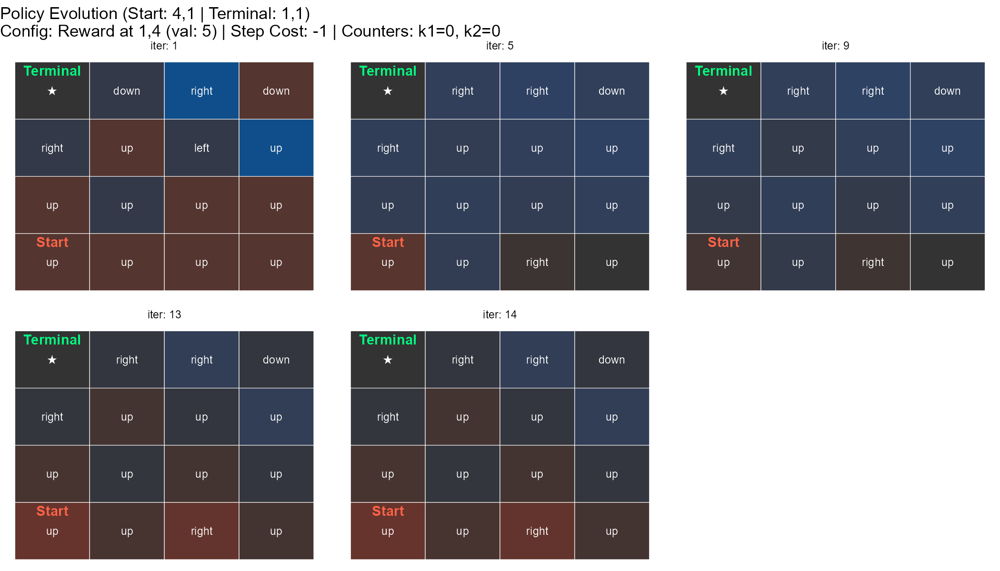
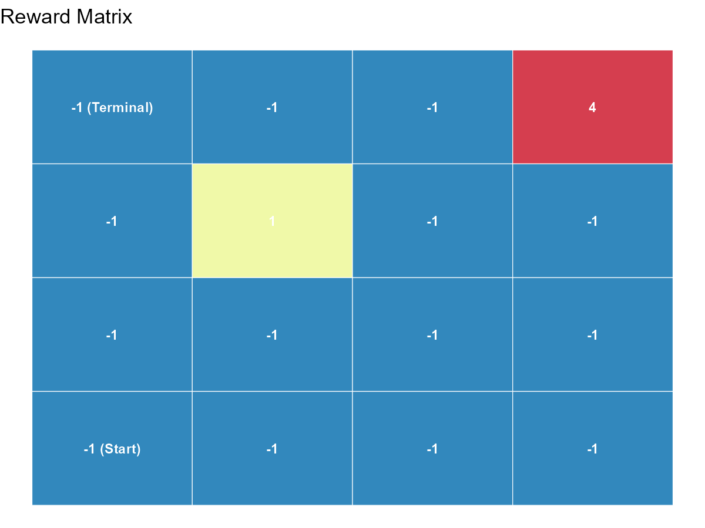
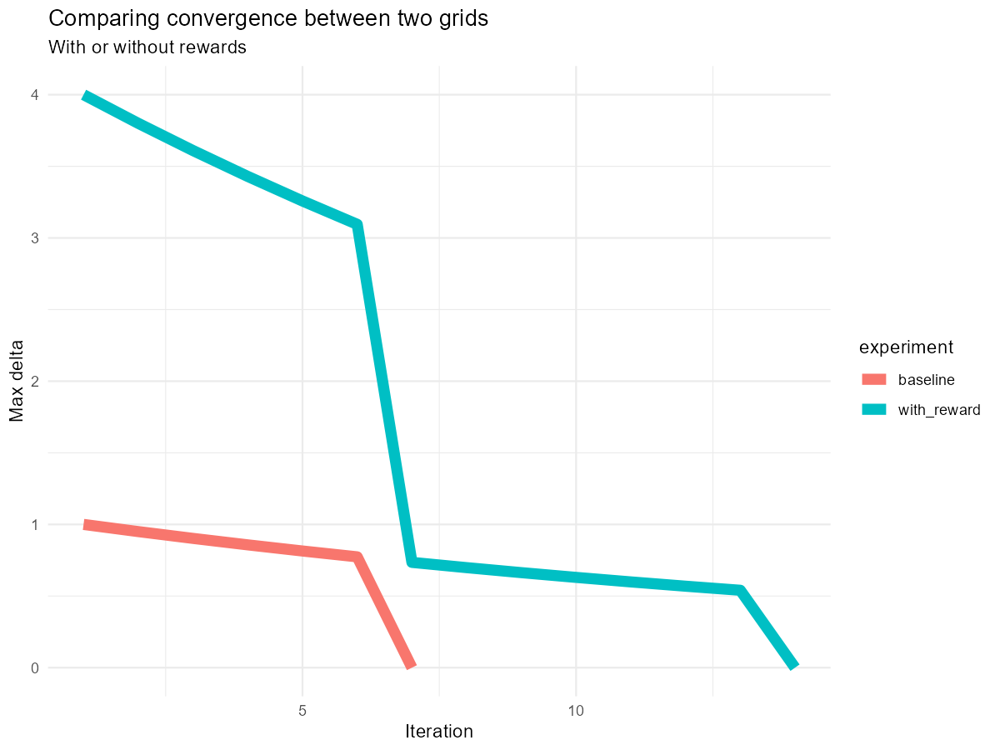

# MDP Grid World
A fun toy project written with Claude. My attempt to adjust Python scripts and frameworks for MDP and RL in general I found on the web into a structured framework in R. Supports value iteration, policy iteration and k-collectable rewards.

origin at **top-left**.

```r
source("mdp_gridworld.R")
```

---

## Table of contents

1. [Constructors](#1-constructors)
2. [Solvers](#2-solvers)
3. [Analytics](#3-analytics)
4. [Utilities](#4-utilities)
5. [Complete workflow](#5-complete-workflow)
6. [Comparing solvers](#6-comparing-solvers)
7. [Design notes](#7-design-notes)

---

## 1. Constructors

### `make_env()`

Always the first call. Defines grid dimensions, agent positions (start & terminal), and global cost parameters.

| Parameter | Default | Description |
|---|---|---|
| `rows`, `cols` | - | Grid dimensions |
| `start` | - | `c(row, col)` agent starting position |
| `terminal` | - | `c(row, col)` absorbing goal. `V = 0` by definition |
| `step_cost` | `-1` | Cost applied on every valid move |
| `wall_reward` | `-Inf` | Reward for attempting an out-of-bounds move. Agent stays in place. |
| `gamma` | `0.95` | Discount factor `(0, 1]`. Use `< 1` with repeatable rewards (`k > 1`) |

```r
env <- make_env(
  rows = 4, cols = 4,
  start    = c(4, 1),
  terminal = c(1, 1),
  step_cost   = -1,
  wall_reward = -Inf,
  gamma       = 0.95
)
```

---

### `add_reward()`

Attaches a collectable bonus to a cell. Chain multiple calls for multiple rewards. Returns the updated env.

| Parameter | Default | Description |
|---|---|---|
| `pos` | - | `c(row, col)` cell location |
| `value` | - | Reward on collection. Net transition reward = `step_cost + value` |
| `k` | `1` | Max collections. Each finite `k` adds a counter dimension to the state space: a cell with `k=3` contributes 4 counter states (0–3) |

```r
env <- env |>
  add_reward(pos = c(1, 4), value = 5, k = 1) |>
  add_reward(pos = c(2, 2), value = 2, k = 3)
```

---

### `add_trap()`

Marks a cell as a trap. Stepping on it teleports the agent to `dest`. Collection counters are **preserved** - the agent keeps what it collected. Step cost applies; an optional `reward` stacks on top.

| Parameter | Default | Description |
|---|---|---|
| `pos` | - | `c(row, col)` trap location |
| `dest` | - | `c(row, col)` teleport destination. Must differ from `pos` |
| `reward` | `0` | Extra reward on trap trigger, on top of `step_cost` |

```r
env <- env |>
  add_trap(pos = c(3, 3), dest = c(4, 1), reward = 0)
```

---

## 2. Solvers

Both solvers accept the same `env` and return an **identical output schema** - results are directly comparable.

### `solve_mdp_value()`

Value iteration. Sweeps all states repeatedly, applying the Bellman optimality update until `max|V_new - V_old| < theta`.

| Parameter | Default | Description |
|---|---|---|
| `theta` | `1e-6` | Convergence threshold on max Bellman residual |
| `max_iter` | `1000` | Hard iteration cap |

### `solve_mdp_policy()`

Policy iteration. Alternates between full policy evaluation (inner loop until convergence) and greedy policy improvement. Initialises with a Manhattan-distance heuristic policy.

| Parameter | Default | Description |
|---|---|---|
| `theta` | `1e-6` | Convergence threshold for policy stability |
| `max_iter` | `100` | Hard cap on improvement steps |
| `eval_theta` | `theta` | Inner evaluation convergence threshold |
| `max_eval_iter` | `10000` | Hard cap on inner evaluation iterations |
| `verbose` | `TRUE` | Print convergence message |

### Shared return schema

| Field | Description |
|---|---|
| `$states` | Full state space tibble: `row`, `col`, `k1`, `k2`, ..., `state_id` |
| `$V` | Named numeric vector. Keys = `state_id` (character). Final converged values |
| `$policy` | Named character vector. Keys = `state_id`. Values: `"up"`, `"down"`, `"left"`, `"right"` |
| `$history` | List of per-iteration snapshots. Each is `$states` with `V`, `policy`, `iter`, `delta` appended |
| `$history_tbl` | All snapshots bound into one long `data.frame`. ggplot2-ready |
| `$n_iter` | Iterations to convergence |
| `$env` | Original env (passed through) |

```r
res_vi <- solve_mdp_value(env)
res_pi <- solve_mdp_policy(env)

# Policy and Value iteration are completley identical for the same problem, throught the entire state space (128, in this case).
> all(res_pi$V == res_vi$V)
[1] TRUE
```

---

## 3. Analytics

### `print_grid()`

Prints `V` or `policy` as a console matrix for a specific counter slice.

| Parameter | Default | Description |
|---|---|---|
| `what` | `"V"` | `"V"` or `"policy"` |
| `counters` | `NULL` (all zeros) | e.g. `c(k1=1, k2=0)` - slice after collecting reward 1 once |

```r
print_grid(res_vi, "V")
print_grid(res_vi, "policy")

# after collecting reward 2 three times:
print_grid(res_vi, "policy", counters = c(k2=3))
```

```

=== policy (counters: k1=0, k2=3) ===
     [,1] [,2]  [,3]  [,4]
[1,] ★    right right down
[2,] up   up    up    up  
[3,] up   up    up    up  
[4,] up   up    right up  

# Note that reward 1 is infered automatically and set to 0. 
# Reminder: it's located at (1,4) with value of 5 and is collectable once.
```

---

### `rollout()`

Simulates the greedy policy from start to terminal. Returns one row per step.

| Parameter | Default | Description |
|---|---|---|
| `max_steps` | `1000` | Safety cap against cyclic policies |

**Returns a `data.frame`:**

| Column | Description |
|---|---|
| `row`, `col` | Position before action |
| `k1`, `k2`, ... | Counter values before action |
| `state_id` | State ID before action |
| `action` | Action taken |
| `reward` | Reward received (step_cost ± bonus) |
| `cum_reward` | Undiscounted cumulative reward |
| `disc_cum_reward` | Discounted cumulative reward. At last row = `V*(start)` |
| `next_row`, `next_col` | Landing position |

```r
traj <- rollout(res_vi)
```

---

### `plot_policy()`

Faceted ggplot showing policy evolution across iterations. Tiles are coloured by V value.

| Parameter | Default | Description |
|---|---|---|
| `max_facets` | `5` | Max iteration snapshots shown. Always includes final iteration |
| `counters` | `NULL` | Counter slice to display. Defaults to all zeros |

```r
plot_policy(res_vi)
```

---

### `plot_rewards()`

Static plot of the reward matrix. Shows step cost everywhere, with reward cells highlighted by their net collection value.

```r
plot_rewards(env)
# Note that the rewards matrix can be ploted prior to solving the policy!
```

---

### `run_experiments()`

Batch-solves a named list of environments with `solve_mdp_value()` and returns unified results.

```r
env_no_reward <- make_env(
    rows = 4, cols = 4,
    start    = c(4, 1),
    terminal = c(1, 1),
    step_cost   = -1,
    wall_reward = -Inf,
    gamma       = 0.95
  )

exp <- run_experiments(list(
  baseline = env_no_reward,
  with_reward = env
))

exp$summary
# experiment  n_states n_iter start_value final_delta
# <chr>          <int>  <int>       <dbl>       <dbl>
# baseline          16      7       -2.85           0
# with_reward      128     14       -1.53           0

# example - convergence comparison
  exp$history_tbl |>
  reframe(delta = first(delta), .by = c(experiment, iter)) |>
  ggplot(aes(x = iter, y = delta, colour = experiment)) +
  geom_line(linewidth = 3) # + .....
```

---

## 4. Utilities
*`breakeven_value` and `minimum_reward` should probably be unified to a single function.*

### `breakeven_value()`

Given a solved result and a reward cell, computes the minimum reward value that makes **re-collecting** worthwhile from the current position (`pos`).

```r
# is it worth collecting (2,2) a second time? It's value is 2.
breakeven_value(res_vi, pos = c(1,2), k_current = 1, collect_pos = c(2,2))

# V(2,2) at k2=2 (post-collect): -0.6715
# Breakeven value: v > 0.638
```
This function generalizes to a practical decision-making question:
given an environment with known costs, grid size etc..., what is the minimum reward a rational agent must be offered to make a detour - or a return visit - worthwhile?
Setting `value` just above the breakeven threshold is the most resource-efficient incentive design.
For all of you econ folks out there...

---

### `minimum_reward()`

Computes the minimum reward value that makes a **detour to the reward cell worthwhile** at all, relative to going directly to terminal.

Reads all parameters from `env`. If `env$rewards` is empty, supply `reward_pos` explicitly.

**Assumptions:** k=1 only; Manhattan-distance paths (no `add_trap`). Warns on multiple rewards (uses first) or k > 1. 
A somewhat safer version of `breakeven_value()`.

**Thoughts:** The only nice feature this functions offers on top of the more general `breakeven_value()` is testing rewards that aren't embeded in `env$reward`. This allows to a-priori test different rewards from the starting point.

```r
# env with reward already configured
minimum_reward(env)

# Start:         (4,1)
# Terminal:      (1,1)
# Reward cell:   (1,4)
# Gamma:         0.95
# V_direct:      -2.8550
# d (to reward): 6 steps
# Min reward:    v >  6.1795
# Current v:     5  =>  not worthwhile ✗
Warning message:
In minimum_reward(env) :
  env contains 2 rewards. Only the first reward at (1,4) is used. 

# env without reward - supply position manually
minimum_reward(env_no_reward, reward_pos = c(1, 4)) # identical output as with the reward.
```
*Since we set the reward to the same location as in `env$rewards[[1]]`, $(1,4)$, the output is identical, other than the last `Current v`.*
---

## 5. Complete workflow

```r
source("mdp_gridworld.R")

# 1. Build environment
env <- make_env(
  rows = 4, cols = 4,
  start    = c(4, 1),
  terminal = c(1, 1),
  step_cost   = -1,
  wall_reward = -Inf,
  gamma       = 0.95
) |>
  add_reward(pos = c(1, 4), value = 5, k = 3) |>
  add_reward(pos = c(2, 2), value = 1, k = 1)

# 2. Visualise reward layout
plot_rewards(env)

# 3. Solve
res <- solve_mdp_value(env)
# Converged in 14 iterations (delta = 0.00e+00)

# 4. Inspect
print_grid(res, "V",      counters = c(k1=0, k2=0))
print_grid(res, "policy", counters = c(k1=0, k2=0))
print_grid(res, "policy", counters = c(k1=3, k2=1))  # fully collected, agent rushes to terminal node.

# 5. Show optimal trajectory
traj <- rollout(res)
cat("Steps to terminal:", nrow(traj))

# 6. Policy evolution plot, before collecting any rewards. 0 is the default, but I explicitly set them here. you can easily observe how the policy changes by simply modifying k1 and k2.
plot_policy(res, max_facets = 6, counters = c(k1=0, k2=0))

# 7. Reward design
minimum_reward(env) # using the unsolved environemnt to calculate minimum reward.
breakeven_value(res, pos = c(1,3), k_current = 1, collect_pos = c(1,4)) # using the already solved results and takes different states of k times collected reward.
```

---

## 6. Comparing solvers

Both solvers produce identical `V*` and `π*`. The difference is in convergence speed: policy iteration uses fewer outer iterations but each is more expensive (full evaluation inner loop). Value iteration uses many cheap sweeps.

```r
res_vi <- solve_mdp_value(env)
res_pi <- solve_mdp_policy(env)

# iterations
cat("Value iteration: ", res_vi$n_iter, "sweeps\n")
cat("Policy iteration:", res_pi$n_iter, "improvement steps\n")
```

---

## 7. Design notes

**State encoding.** State = `(row, col, k1, k2, ...)`. Each k reward adds one counter dimension (for k=0, k=1, k=2.., k=n). State count = `rows × cols × (K1+1) × (K2+1) × ...`. A 4×4 grid with two rewards at k=3 and k=1 gives `4×4×4×2 = 128` states.

**Traps.** Let's just not use it for now.

**Wall reward.** Default `-Inf`. I think i'll hide it. it's pointless. It can cause infinite loops of hitting the wall, like in [Olds & Milner, 1954](https://psycnet.apa.org/record/1955-06866-001).

## Final thoughts
Much of the actual code was written with AI (mostly CC). I enjoyed toying with this grid-search example, especially with finding the minimum rewards required to make it worth for the agent/learner to make the detour. I would love in the future to implement more advanced solvers, such as Q learning with Deep Quality networks (Q-quality: an off-policy solver that allows us to extract both the optimal value and policy).

feel free to copy and do whatever. it's not even under MIT. It'd be nice if you let me know though..
Yann ❤